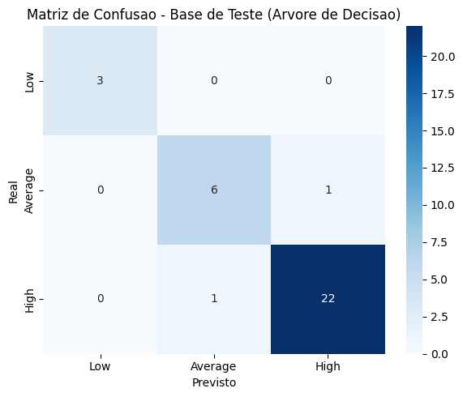
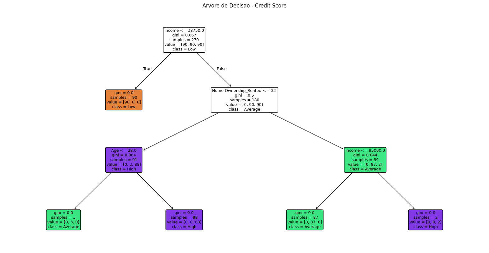

# 💳 Credit Score — Classificação e Modelagem

Projeto desenvolvido durante a formação **Profissão: Cientista de Dados da EBAC**, reunindo as etapas dos módulos **17 e 21** em um único projeto de classificação de Score de Crédito.

> **M17 → Pré-processamento e preparação dos dados**  
> **M21 → Construção, avaliação e interpretação do modelo de Árvore de Decisão**

---

## 🎯 Objetivo

Preparar uma base de clientes e desenvolver um modelo de Machine Learning capaz de classificar o **Score de Crédito** em três categorias:

- `Low`
- `Average`
- `High`

O projeto contempla desde o tratamento e exploração dos dados até a construção e avaliação de modelos de classificação.

---

## 🧠 Sobre o projeto

A primeira etapa do projeto foi dedicada ao **pré-processamento dos dados**, preparando a base para a modelagem. Foram realizadas verificações de tipos, tratamento de valores ausentes, análise exploratória, análise de correlação, transformação de variáveis categóricas e separação das bases de treino e teste.

Na sequência, foi aplicada uma **Árvore de Decisão** para classificação do Score de Crédito. O modelo foi avaliado utilizando métricas de desempenho, matriz de confusão, visualização da estrutura da árvore e análise da importância das variáveis.

Também foi realizada uma comparação com o modelo de **Naive Bayes**, desenvolvido em etapa anterior da formação.

---

## 🛠️ Tecnologias e bibliotecas

- Python
- Pandas
- NumPy
- Matplotlib
- Seaborn
- Scikit-learn
- Jupyter Notebook

---

## 🔎 Etapas do projeto

### 1. 📥 Carregamento e preparação dos dados

A base `CREDIT_SCORE_PROJETO_PARTE1.csv` foi carregada e analisada inicialmente.

Entre os procedimentos realizados:

- Verificação dos tipos de dados;
- Conversão da variável `Income` para formato numérico;
- Tratamento de valores ausentes em `Age`;
- Inspeção da estrutura da base;
- Separação entre variáveis preditoras (`X`) e variável-alvo (`y`).

---

### 2. 📊 Análise exploratória

Foram realizadas análises univariadas e bivariadas para compreender a distribuição das variáveis e investigar possíveis relações entre:

- Idade;
- Renda;
- Número de filhos;
- Gênero;
- Escolaridade;
- Estado civil;
- Tipo de residência;
- Score de Crédito.

Também foi analisada a correlação entre as variáveis numéricas.

Um dos principais achados foi uma correlação de aproximadamente **0,62 entre idade e renda**, indicando uma relação positiva moderada entre as duas variáveis.

---

### 3. 🧩 Tratamento das variáveis categóricas

Foram utilizadas abordagens diferentes de acordo com a natureza das variáveis:

- Variáveis ordinais → codificação numérica;
- Variáveis nominais → **One-Hot Encoding**.

A variável `Credit Score` foi transformada em uma variável numérica para utilização como alvo do modelo.

---

### 4. ⚖️ Balanceamento da variável-alvo

A base de treino apresentou desbalanceamento entre as classes do Score de Crédito.

O balanceamento foi realizado por **oversampling**, exclusivamente na base de treinamento, preservando a distribuição original da base de teste.

---

### 5. 🌳 Árvore de Decisão

Com a base preparada, foi desenvolvido um modelo de **Decision Tree Classifier** utilizando o critério de Gini.

O modelo apresentou:

- **Acurácia no treino:** aproximadamente 100%
- **Acurácia no teste:** aproximadamente 93,9%
- **Profundidade da árvore:** 3 níveis

A diferença entre os resultados de treino e teste indica um certo grau de overfitting, mas o desempenho no conjunto de teste permaneceu satisfatório para a base analisada.

---

### 6. 🔍 Importância das variáveis

A análise de importância das features mostrou que as duas principais variáveis utilizadas pela árvore foram:

1. `Income`
2. `Home Ownership_Rented`

Um novo modelo foi então treinado utilizando apenas essas duas variáveis e manteve desempenho praticamente equivalente ao modelo completo, com aproximadamente **100% de acurácia no treino e 93,9% no teste**.

Isso demonstrou que, nesta base, a redução das variáveis não provocou perda relevante de desempenho.

---

### 7. 🆚 Comparação com Naive Bayes

A Árvore de Decisão foi comparada ao modelo de Naive Bayes desenvolvido anteriormente.

| Modelo | Acurácia no treino | Acurácia no teste |
|---|---:|---:|
| Naive Bayes | ≈ 100% | ≈ 97% |
| Árvore de Decisão | ≈ 100% | ≈ 93,9% |

Para esta base, o **Naive Bayes apresentou melhor desempenho no conjunto de teste**, enquanto a Árvore de Decisão apresentou como principal vantagem a interpretabilidade visual de suas decisões.

---

## 📈 Visualizações

### Matriz de Confusão

A matriz de confusão permite observar os acertos e erros do modelo em cada classe do Score de Crédito.



### 🌳 Estrutura da Árvore de Decisão

A visualização da árvore permite compreender as condições utilizadas pelo modelo para realizar as classificações.



---

## 💡 Principais aprendizados

Este projeto permitiu consolidar conhecimentos em:

- Pré-processamento de dados;
- Tratamento de valores ausentes;
- Análise exploratória;
- Análise de correlação;
- Codificação de variáveis categóricas;
- Balanceamento de classes;
- Separação entre treino e teste;
- Classificação supervisionada;
- Árvore de Decisão;
- Análise de importância de features;
- Matriz de confusão;
- Avaliação e comparação de modelos.

---

## 📂 Estrutura sugerida do repositório

```text
credit-score/
│
├── data/
│   └── CREDIT_SCORE_PROJETO_PARTE1.csv
│
├── notebooks/
│   ├── M17_Credit_Score_Preprocessamento.ipynb
│   └── M21_Credit_Score_Arvore_Decisao.ipynb
│
├── images/
│   ├── matriz-confusao-teste.png
│   └── arvore-decisao.png
│
└── README.md
```

---

## 📚 Formação

Projeto desenvolvido durante a formação **Profissão: Cientista de Dados — EBAC**.

## 👤 Autor

**Antônio Gabriel Vieira Araújo**

[GitHub](https://github.com/Gabriel-Araujo-dev) · [LinkedIn](https://www.linkedin.com/in/gabrielaraujo05/)
